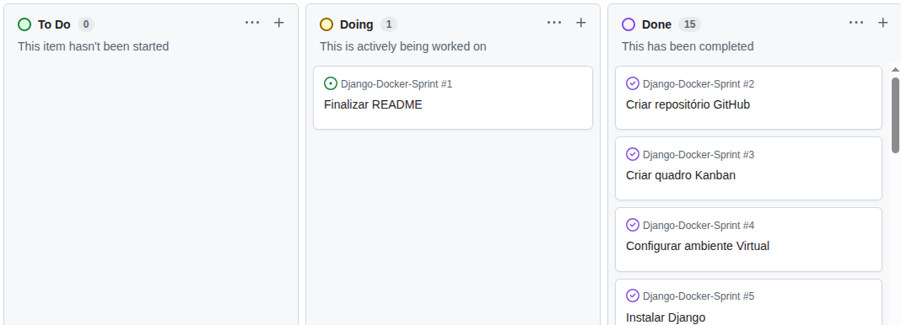

# Serviço Django com Docker

## Sobre o projeto

Este projeto foi desenvolvido como parte de uma atividade acadêmica para demonstrar conhecimentos no desenvolvimento
de uma aplicação web utilizando Django, Docker, Docker Compose e GitHub.

## Pré-requisitos

- Docker Desktop instalado.
- WSL 2 configurado (para usuários do Windows).
- Git (para clonar o repositório).

## Como executar o projeto

1. Clone o repositório.
2. Entre na pasta do projeto.
3. Execute o comando: docker-compose up
4. Abra o navegador e acesse: http://localhost:8000

## Quadro Kanban

## Quadro Kanban

## Autor
Maria Clara
